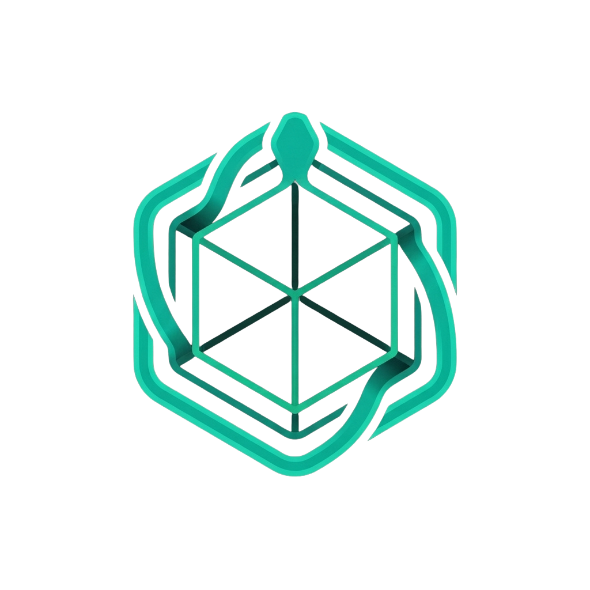
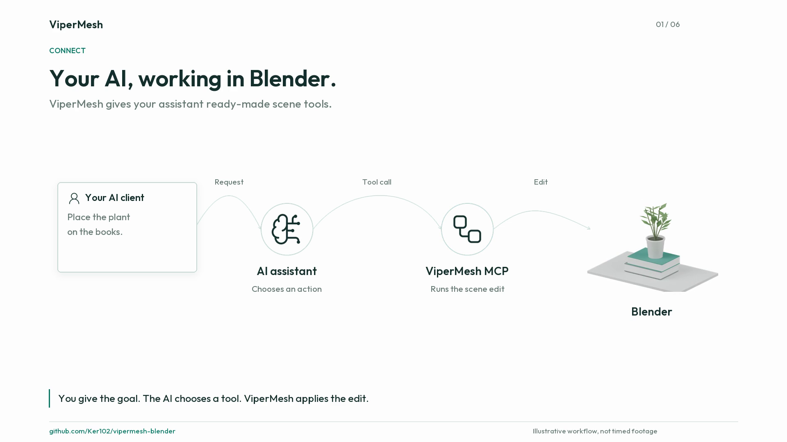
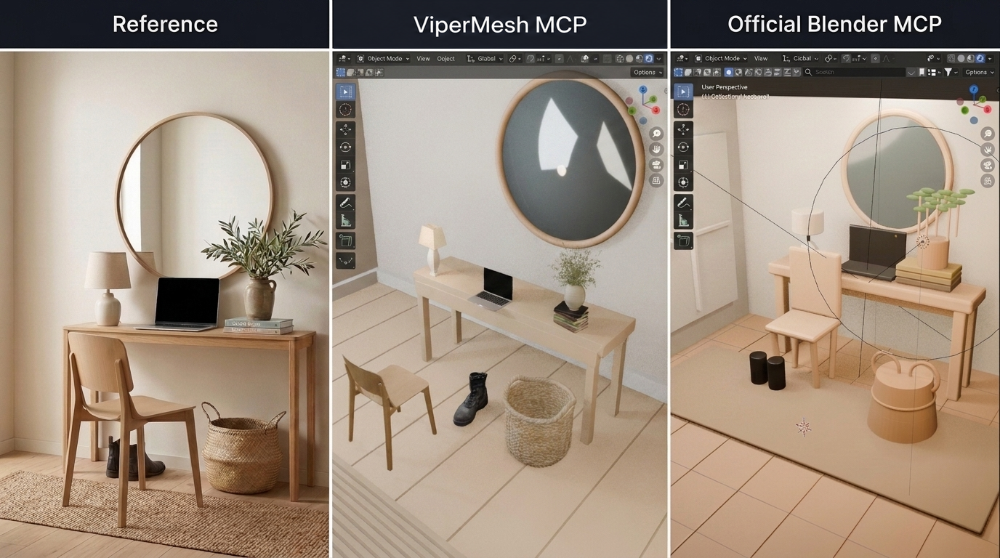

<div align="center">

<!-- i18n:languages:start -->
[English](../../../README.md) | [Español](../es/README.md) | [简体中文](../zh-CN/README.md) | [Français](../fr/README.md) | [日本語](../ja/README.md) | [Deutsch](../de/README.md) | [Português (Brasil)](../pt-BR/README.md)
<!-- i18n:languages:end -->

<a href="https://ker102.github.io/vipermesh-blender/"></a>

<h1>ViperMesh for Blender</h1>
<p>AI エージェント向けの、オープンソースの Blender MCP サーバーとアドオン。</p>

[](https://github.com/Ker102/vipermesh-blender/actions/workflows/ci.yml)
[](https://github.com/Ker102/vipermesh-blender/releases)
[](../../../LICENSE)
[](https://modelcontextprotocol.io/)

**より少ないコードと待ち時間で、Blender に AI の支援を。**

シーン編集の高速化、AI トークンの削減、より十分に確認された結果を目指しています。

<p>
<a href="https://github.com/Ker102/vipermesh-blender/releases/latest"></a>
<a href="docs/client-setup.md"></a>
</p>

[プロジェクトの概要と設定](https://ker102.github.io/vipermesh-blender/)
| [ViperMesh Studio のウェイティングリスト](https://vipermesh-studio.vercel.app/waitlist)

</div>

---

ViperMesh for Blender は、対応する AI アシスタントが Blender のシーン内で作業できるようにする、無料でオープンソースの **Blender MCP サーバーとアドオン**です。別のコーディングプロジェクトを始めたい人ではなく、3D シーンの制作や編集を手伝ってほしい Blender 制作者、愛好家、ゲーム制作者のためのものです。

**目標は、AI 支援作業の高速化、AI トークンの削減、より十分に確認された結果です。**
多くの一般的な編集で新しい Python コードを書く代わりに、アシスタントはすぐに使える Blender 操作を利用できます。あなたは Blender で作業を続け、アシスタントに何を手伝ってほしいかを決めます。

<a id="watch-the-overview"></a>
## 紹介動画を見る

[](https://ker102.github.io/vipermesh-blender/#overview)

[72 秒の動画を見る](https://ker102.github.io/vipermesh-blender/#overview)、または [MP4 をダウンロード](https://ker102.github.io/vipermesh-blender/assets/connector-overview.mp4)できます。
AI クライアントが用意された Blender 操作をどう使うか、生成するコードを減らすことがなぜ役立つか、始めるには何が必要かを紹介します。これは音声のない図解による紹介であり、時間計測付きのベンチマーク録画ではありません。GitHub の README から再生可能な動画にリンクしています。

<a id="why-vipermesh-for-blender"></a>
## ViperMesh for Blender を使う理由

| 重視すること | ViperMesh の支援 |
| --- | --- |
| AI の利用量を減らす | 再利用可能な操作により、対応するタスクでアシスタントが生成する Blender コードを減らします。 |
| 待ち時間を減らす | 接続を保持し、関連する操作をまとめて実行できるため、段階ごとの設定の繰り返しを避けられます。 |
| シーンを十分に確認する | 組み込み検査は、浮いたオブジェクト、誤った向き、クリアランスの問題を見つける助けになります。アシスタントは画像を確認し、誤りを修正できます。 |
| アシスタントが使いやすい | 検出可能なツールと簡潔なガイダンスで、利用できる操作と使い方を説明します。 |
| 独自の作業にも対応する | 用意されたツールで扱えない依頼には、アシスタントが引き続き Python を記述できます。 |

AI トークンは、モデルが読み書きするテキストの単位です。コード生成を減らすと AI の利用量を削減できる場合がありますが、合計トークン数、費用、時間はモデルとタスクにも左右されます。シーン検査は正確さの確認を助けますが、美しさや誤りのない結果を保証するものではありません。

<a id="one-reference-two-blender-workflows"></a>
## 同じ参考画像、二つの Blender 作業手順

<p align="center">
<a href="../../../site/assets/scandinavian-entryway-comparison.png"></a>
</p>

ViperMesh Blender MCP の実行・検証フレームワークと利用可能なアセットを使った、過去の画像再構成テストです。変更したのは中央の見出しの名称だけであり、参考画像と両方のシーンのスクリーンショットは元のままです。これは単一の例であって、あらゆる結果を保証するものではありません。公開アドオンには、非公開の Studio アセットライブラリは含まれません。

[Blender MCP の事例研究、前編を読む](https://kristoferjussmann.me/case-studies/vipermesh/)
| [比較画像を原寸で開く](../../../site/assets/scandinavian-entryway-comparison.png)
| [画像の整合性記録](../../../site/assets/scandinavian-entryway-comparison.provenance.json)

<a id="what-can-it-help-with"></a>
## どのような作業を支援できるか

- シーン内でオブジェクトを作成、移動、複製、配置する。
- エッジを丸め、マテリアルを調整し、カメラを設定し、照明を変更する。
- オブジェクトが支持物に載っているか、十分な隙間があるかを確認する。
- メッシュの整理、リトポロジー、UV の準備、リギング、ウェイトを支援する。
- アニメーションの設定、エクスポートの準備、結果の検査を行う。

たとえば、アシスタントに次のように依頼できます。

> かごをテーブルの右側の下に移動し、脚と交差しないようにして。

> この家具の全体の形を保ちながら、鋭いエッジを丸めて。

> このシーンに支持されていないオブジェクトがあるか確認し、修正が必要な箇所を見せて。

これらは依頼の例であり、事前に作られたシーンテンプレートではありません。ツールが対応する操作については、自分で Blender Python を記述する必要はありません。

<a id="how-is-it-different-from-the-original-blendermcp"></a>
## 元の BlenderMCP との違い

ViperMesh は、現在 MCP for Blender という名称になっている [Siddharth Ahuja の元の BlenderMCP プロジェクト](https://github.com/ahujasid/mcp-for-blender)を基盤としています。主な違いは、一般的な編集で新しく生成した Python に頼るのではなく、幅広い既成の編集操作、再利用可能な作業手順、シーン検査を重視することです。

両プロジェクトとも、シーンを検査し、独自の Python を実行できます。元のプロジェクトには、アセットや生成機能との連携もあります。ViperMesh は、日常的なシーン操作でのトークン効率、速度、アシスタントの使いやすさ、検証のしやすさを目指しています。すべてのタスクで優れているという主張ではなく、公開コネクタに ViperMesh Studio の全機能が含まれるという意味でもありません。

[ウェブサイトのインストールガイド](https://ker102.github.io/vipermesh-blender/setup/) · [Harness Library の掲載情報](https://kaelux-labs.github.io/harness-library/harnesses/vipermesh-blender/)

<a id="requirements"></a>
## 要件

- 現在テスト対象となっているリリースは Blender 5.2
- Node.js 20 以降
- stdio サーバーに対応する MCP 互換クライアント

MCP は Model Context Protocol の略であり、AI アシスタントが別のアプリケーションのツールを使えるようにする接続規格です。こうした接続に対応する AI アプリが必要であり、アドオンをインストールするだけで Blender に AI モデルが追加されるわけではありません。

<a id="install"></a>
## インストール

<a id="1-install-the-blender-addon"></a>
### 1. Blender アドオンをインストールする

[最新リリース](https://github.com/Ker102/vipermesh-blender/releases/latest)から、バージョン付きのアドオン `.py` またはアドオン `.zip` をダウンロードします。
Blender で次の操作を行います。

1. **Edit > Preferences > Add-ons** を開きます。
2. **Install from Disk** を選び、ダウンロードした Python ファイルを指定します。
3. **ViperMesh for Blender** を有効にします。
4. 3D ビューポートのサイドバーで **ViperMesh** を選び、**Start Local Bridge** をクリックします。

エージェントのセッション全体で、ブリッジを動かし続けてください。

<a id="2-install-the-mcp-server"></a>
### 2. MCP サーバーをインストールする

**パッケージを使う場合:** [`v1.3.0` の MCPB バンドル](https://github.com/Ker102/vipermesh-blender/releases/download/v1.3.0/vipermesh-blender-1.3.0.mcpb)をダウンロードし、ローカル MCPB 拡張機能に対応するクライアントへインポートします。Node サーバーと依存関係が含まれるため、リポジトリのクローンやビルドは不要です。Node.js と、別途有効にする Blender アドオンは引き続き必要です。

コネクタは [Smithery](https://smithery.ai/servers/ker102/vipermesh-blender) と [公式 MCP Registry](https://registry.modelcontextprotocol.io/v0.1/servers?search=io.github.Ker102/vipermesh-blender)にも掲載されています。これらが配布するのはローカルコネクタであり、ホストされた Blender サービスではありません。チェックサム、手動での展開方法、現在の検証上の制限については、[配布とバンドルの設定](docs/mcp-distribution.md)を参照してください。

**ソースを使う場合:** npm パッケージが公開されるまでは、クローンしてビルドしてください。

```bash
git clone https://github.com/Ker102/vipermesh-blender.git
cd vipermesh-blender
npm install
npm run build
```

<a id="3-connect-your-ai-assistant"></a>
### 3. AI アシスタントを接続する

MCPB をインポートした場合、クライアントはバンドルから起動設定を読み込みます。ソースを使う場合は、ビルドされたエントリーポイントを絶対パスで指定してください。

```json
{
  "mcpServers": {
    "vipermesh-blender": {
      "command": "node",
      "args": [
        "C:/absolute/path/to/vipermesh-blender/dist/public-portable-blender-mcp.js"
      ]
    }
  }
}
```

このコマンドは、MCP クライアントから一度だけ起動してください。Blender の操作ごとに `npm`、`npx`、`tsx` を再実行しないでください。Codex、JSON 設定型のクライアント、互換性、任意の Docker MCP Toolkit 経路については、[MCP クライアントの設定](docs/client-setup.md)を参照してください。

<a id="technical-details"></a>
## 技術的な詳細

以下は、AI 接続の設定や開発を行うための項目です。Blender ユーザーは、上記のインストール手順と依頼の例から始められます。

<a id="connection-model"></a>
### 接続モデル

```text
MCP-compatible AI assistant
        |
        | stdio, one long-lived process
        v
ViperMesh MCP server
        |
        | serialized loopback connection
        v
ViperMesh Blender addon (127.0.0.1:9876)
        |
        v
Blender scene
```

MCP サーバーはネットワークリスナーを開きません。Blender アドオンは既定でループバックを待ち受け、ViperMesh のサイドバーに **Stopped**、**Ready**、**Agent connected**、**Error** のいずれかの状態を表示します。

<a id="first-agent-calls"></a>
### エージェントの最初の呼び出し

1. `bootstrap_vipermesh_session` を呼び出します。
2. `call_blender_tool(name="get_scene_info")` でシーンを検査します。
3. `search_3d_guidance` でタスクのガイダンスを検索します。
4. `list_blender_tools` で関連する機能だけを検出します。
5. 構築、検査、修正を行い、最終処理と保存を行います。

公開されている MCP の機能には、次が含まれます。

- `bootstrap_vipermesh_session`
- `check_blender_connection`
- `list_blender_tools`
- `call_blender_tool`
- `call_blender_tool_batch`
- `run_blender_scene_stage`
- `get_blender_agent_context`
- `search_3d_guidance`
- `get_3d_guidance_document`

リクエストの形式、一括実行の規則、段階的な作業手順、ローカルのツールスキル、トラブルシューティングについては、[コネクタの完全なマニュアル](docs/portable-blender-mcp.md)を読んでください。リポジトリには、インストール可能な [`using-vipermesh-blender` エージェントスキル](skills/using-vipermesh-blender/SKILL.md)も含まれます。

<a id="security"></a>
## セキュリティ

このコネクタは、信頼できるローカルワークステーションでの使用を想定しています。`execute_code` は Blender 内で任意の Python コードを実行できます。信頼できる MCP クライアントだけを接続し、ブリッジをループバックのままにし、影響の大きい操作や破壊的な操作を確認してください。

信頼境界と非公開の脆弱性報告手順については、[SECURITY.md](SECURITY.md)を参照してください。

<a id="public-connector-scope"></a>
## 公開コネクタの範囲

このリポジトリには、オープンソースの Blender アドオン、ポータブル MCP サーバー、ポータブルな公開ツールスキル、コネクタのテストが含まれます。ViperMesh アプリケーション、認証、課金、非公開プロンプト、非公開 RAG データ、クラウドのモデルルーティング、非公開アセット、生のベンチマーク記録、非公開の評価データセットは含まれません。図解による比較は別途提供された公開の証拠であり、同梱のアセットライブラリではありません。

このコネクタには、商用の 3D 生成プロバイダーは含まれません。ニューラル生成は、将来、特定のプロバイダーに依存しない認証付きサービスを通じて追加でき、Blender に第三者の認証情報を埋め込む必要はありません。

<a id="frequently-asked-questions"></a>
## よくある質問

<a id="do-i-need-a-paid-vipermesh-account"></a>
### 有料の ViperMesh アカウントは必要か

いいえ。公開アドオンとローカル接続は、ViperMesh アカウントなしで無料で使用できます。AI アプリやモデルの提供者が別途料金を請求する場合があります。アドオンには無料の AI モデル利用権は含まれません。

<a id="do-i-need-to-be-a-programmer"></a>
### プログラミングが必要か

対応する Blender 編集については、Python を書く必要はありません。ただし、初期設定にはアドオンのインストールと対応 AI アプリへの接続が必要です。対応クライアントでは MCPB バンドルを使用し、それ以外では提供されたコマンドでソースからビルドしてください。Blender のブリッジを別途有効にし、クライアントを設定する必要があるため、すべての環境でワンクリックのインストールができるわけではありません。

<a id="does-vipermesh-replace-execute_code"></a>
### ViperMesh は `execute_code` を置き換えるか

いいえ。構造化された操作によって不要な Blender Python の生成を減らしますが、独自のジオメトリ、プロシージャル効果、特殊なノードグラフ、未対応の作業手順には `execute_code` を残しています。

<a id="why-must-the-mcp-process-stay-running"></a>
### MCP プロセスを動かし続ける理由は

プロセスは Blender への直列化された接続を保持します。呼び出しごとに再起動すると、避けられるはずの起動、通信、エージェントツールの負担が増えます。

<a id="does-it-require-docker"></a>
### Docker は必要か

いいえ。ローカル stdio に対応する MCP クライアントは、Node サーバーを直接起動します。Docker MCP Toolkit は任意のパッケージ化とゲートウェイの経路であり、ホストから Blender のループバックへの接続を複数のプラットフォームで検証する必要があるため、まだサポートされた ViperMesh のインストール経路ではありません。

<a id="does-the-public-connector-require-vipermesh-cloud-authentication"></a>
### 公開コネクタに ViperMesh のクラウド認証は必要か

いいえ。公開アドオンとローカル MCP サーバーは、ViperMesh 認証なしで動作します。将来のホスト型モデルや専有のオーケストレーションは、別の製品機能です。

<a id="can-it-use-installed-blender-addons"></a>
### インストール済みの Blender アドオンを使用できるか

コネクタはインストール済みアドオンを検査し、信頼されたローカル自動化に対応します。未知のアドオン操作は、エージェントが呼び出せる機能として公開する前に確認してください。

<a id="development"></a>
## 開発

```bash
npm install
npm run check
python -m py_compile addon/vipermesh-addon.py
```

プルリクエストを作成する前に、[CONTRIBUTING.md](CONTRIBUTING.md)を参照してください。

<a id="license-and-attribution"></a>
## ライセンスと帰属表示

ViperMesh for Blender は [MIT ライセンス](../../../LICENSE)で公開されています。Siddharth Ahuja の [BlenderMCP](https://github.com/ahujasid/mcp-for-blender) から派生した成果が含まれます。帰属表示と商標については、[NOTICE.md](NOTICE.md)を参照してください。
